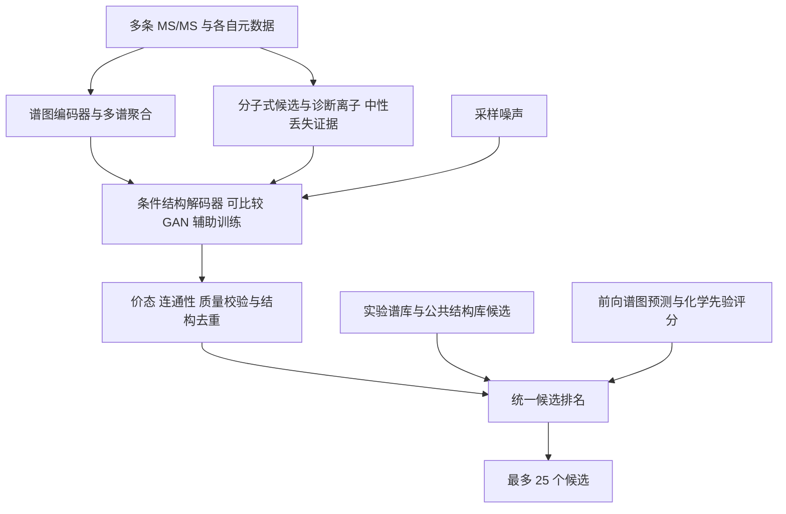

# 质谱结构生成与 GAN 可行性分析

日期：2026-10-01。本文结合用户提供的《质谱到分子结构生成架构解读》、当前项目代码与原始论文，提出实验设计。本轮已阅读附件并核查文献，未训练 GAN、下载生成模型或提交比赛。历史最佳公开成绩在已核实记录中仍为 0.176。

建议优先验证对抗困难负样本是否改善谱图与候选结构的排序；库外结构生成应建立独立的条件解码实验。两个问题需要不同的模型部件和验收指标。

## 附件的主要观点与修正

附件描述了“谱图编码器 → 隐表征 → 图或 SMILES 解码器”，指出生成结果需要碎裂一致性检查，并澄清 DreaMS 本身没有分子生成解码器。这些区分对本项目有帮助。

需要修正四点：

1. **DreaMS 的用途不限于检索。** 它是谱图表征模型，可微调用于谱图相似性、分子指纹和化学性质预测；直接生成分子仍需另配解码器。[DreaMS 原论文](https://www.nature.com/articles/s41587-025-02663-3)
2. **隐向量各维度的化学含义是待检验假设。** 不能直接认定某一维就是官能团或环结构。现代条件解码器也可以关注多个谱峰 token，无需把全部信息压缩到一个固定向量。
3. **学到统计映射不等于证实碎裂机理。** 碎片关系图的连边往往需要质量差、分子式推断或碎裂模型，原始峰列表本身不提供真实的父子裂解关系。
4. **模拟谱图提供一致性证据。** 近似模型预测不好时，正确分子也可能得低分；不同异构体可能产生近似谱图。因此不宜把模拟谱图一致性称作物理证明，也不宜初期直接据此删除候选。CFM-ID 可用于前向谱图预测和结构排名，但须验证其仪器、碰撞能量与加合物适配。[CFM-ID 4.0 原论文](https://pmc.ncbi.nlm.nih.gov/articles/PMC9064193/)

## 当前代码对应架构的哪一部分

| 部件 | 当前状态 | 代码证据 |
|---|---|---|
| 谱图输入 | 峰、强度、前体及中性丢失数值特征，附加元数据 | [data.py](../casmi_ml/data.py) |
| 谱图编码 | 小 Transformer，以及 768 维残差编码器等受控架构 | [models.py](../casmi_ml/models.py)、[scale_models.py](../casmi_ml/scale_models.py) |
| 指纹输出 | radius=2、2048 位 Morgan 指纹预测 | [data.py](../casmi_ml/data.py)、[scale_models.py](../casmi_ml/scale_models.py) |
| 分子图编码 | 编码已经存在的候选结构，计算与谱图的匹配分数 | [direct_models.py](../casmi_ml/direct_models.py) 第 97–130 行 |
| 化学先验 | 可选的诊断离子及特定中性丢失与 SMARTS 支持关系；尚未验证真实收益 | [接入说明](CHEMICAL_PRIORS_20261001.md) |
| 结构解码 | 尚无图/SMILES 生成器，也没有生成候选的训练、采样和验收流程 | 需新增 |

现有“图模型”位于候选分子侧。它没有把谱图构成裂解图，也不负责从零画出结构。

此前图排序独立验收的 unknown MRR 从 0.017743 降到 0.016659，双方候选召回均为 0.075。这个结果说明候选内排序本身也存在问题，不能把所有不足归因于数据库覆盖。该留出集已被查看，后续不能再次用于模型选择后的独立验收。[历史报告](DIRECT_RANK_20260929.md)

## GAN 的三种用途

| 用途 | 解决的问题 | 项目优先级与局限 |
|---|---|---|
| 对抗挑选困难负样本 | 区分同质量或同分子式的候选 | 优先做小实验；候选池不变，不增加库外答案 |
| 条件 latent GAN + 分子解码器 | 为候选库缺失的结构生成新候选 | 有研究价值；需要结构预训练、谱图条件化与独立生成基线 |
| 直接生成整张分子图的 GAN | 端到端结构生成 | 暂后置；离散图梯度、化学约束和多样性均需处理 |

2026 年预印本 **MS2MetGAN** 直接支持第一类思路：生成谱图条件下的 decoy 结构 latent，训练匹配判别器，最终仍排序数据库候选。其测试限于 [M+H]+，候选库明确包含真答案，不能据此推断库外生成能力或本比赛成绩。[原论文](https://arxiv.org/html/2603.13342v1)

**MolGAN** 原实验在最多 9 个重原子、C/N/O/F 的 QM9 分子上进行，作者承认模式坍缩。其合法率不能外推到本赛 157–1159 Da 的分子；原配置大小也不是所有 GAN 的理论上限。一次输出邻接矩阵的成本随节点数平方增长。[MolGAN 原论文](https://arxiv.org/html/1805.11973)

**LatentGAN** 先训练结构编码器与解码器，再在连续结构 latent 上训练 GAN，可以作为第二类架构参考。原版没有谱图条件。移植前应先测试真实结构 latent 能否准确重建本项目的天然产物，特别是较大分子。[LatentGAN 原论文](https://link.springer.com/article/10.1186/s13321-019-0397-9)

模式坍缩在本赛尤其不利：多次生成相同或等价结构会减少有效的前 25 名候选。判别器必须同时读取谱图与候选结构；只判断分子像不像真实分子，不能约束它是否解释该谱图。生成指纹也不能唯一还原分子，仍需结构解码器。

## 建议的最小排序实验

复用 [direct_experiment.py](../casmi_ml/direct_experiment.py) 第 399–405 行的负样本采样接口，比较：

1. **A：现有随机质量近邻负样本。**
2. **B：普通 Top-K 困难负样本。** 用当前匹配模型选择高分错误候选，不加对抗网络。
3. **C：条件对抗采样器。** 在与 A/B 相同的真实候选池内输出采样分布，优先选取判别器容易误判的错误结构。

第一轮固定谱图编码器、候选池、匹配架构、每条谱的 15 个负样本及融合规则，控制训练预算并记录额外候选评分成本。适用的训练样本优先采用真实同分子式异构体；必须排除正确结构及按官方规范等价的互变异构体。

C 是对抗检索训练，生成的是候选采样分布。它与 IRGAN 的思想相关，针对本谱图任务仍是待验证设计。[IRGAN 原论文](https://arxiv.org/abs/1705.10513)

相比自由生成假 latent，真实候选采样更容易检查化学合法性与负标签。加入随机采样混合和熵约束，避免采样器长期选择同一错误候选。只有 C 稳定优于 B，才说明对抗训练提供了额外价值。

## 库外生成的独立路线

生成条件应包含多谱表征、分子式候选、加合物与离子模式、各谱碰撞能量，以及可靠的诊断证据。分子式存在不确定性时应保留多个方案；官能团证据可作为软约束，缺少某个峰通常不足以排除结构。

先用公开结构预训练解码器，再用谱图配对数据学习条件生成。应先建立无 GAN 的监督条件解码基线，然后只改变对抗损失，比较相同生成预算下的准确召回。真实指纹到结构的重建率、预测指纹到结构的召回率需要分别测量，避免把编码误差与解码失败混在一起。

MSNovelist 提供“谱图预测指纹 → 条件 SMILES 生成”的参考范式；其原版 CSI:FingerID 指纹与我们 2048 位 Morgan 指纹不同，不能直接替换输出头或加载解码器。[MSNovelist 原论文](https://www.nature.com/articles/s41592-022-01486-3)

DiffMS 是另一项可比较的生成基线，结合分子式约束、峰分子式/中性丢失建模和图扩散。作者提供代码及检查点，但尚未测试其本赛适配和运行成本。其 MassSpecGym 真分子式条件下 Top1 为 2.30%、Top10 为 4.25%，也体现严格泛化下准确结构生成的难度。[原论文](https://arxiv.org/html/2502.09571v2)、[作者代码](https://github.com/coleygroup/DiffMS)

模板引导生成也是后续备选：MetGenX 利用检索得到的结构模板指导生成，适合探索天然产物相近骨架。其数据库受限模式与库外模式必须分别比较，不能用前者的高准确率代表真正库外生成。[MetGenX 原论文](https://www.nature.com/articles/s41467-026-72149-6)

生成后可先采用低成本质量、价态、连通性与诊断先验评分，再对较少的候选做前向谱图预测。初期保留已验证的强谱库匹配保护，生成分支在低置信度区域参与融合；候选权重、名额和保护门槛只在开发集选定。

## 验收与推进顺序

| 实验 | 主指标 | 必须保持清楚的边界 |
|---|---|---|
| 固定候选池排序 | 总体 MRR@25、候选池内条件 MRR、Top1/5/25 | A/B/C 召回相同；收益来自排名 |
| 库外生成 | 原先缺失结构的准确新召回、去重后 Recall@25、最终 MRR@25 | 冻结全部候选库快照，明确答案原来是否存在 |
| 运行质量 | 有效率、质量/分子式通过率、独特候选数、时间与显存 | Tanimoto、合法率和新颖率只作辅助 |

按官方 RDKit 版本与互变异构体归一化、InChIKey14 身份判定去重和评估。按分子身份分组防止多谱泄漏，增加骨架和来源分层验证；结构预训练见过真答案的情况必须单独报告。对真正新结构能力的实验，要在预训练前排除验收真结构。

建议排序实验预先冻结配对 bootstrap 验收门槛：unknown MRR 改善的 95% 区间下界大于 0；known MRR 差值不低于 −0.001、Top1 差值不低于 −0.005。生成实验另行冻结召回、排名、采样和时间预算；不得仅凭有效率提升进入比赛提交。历史已查看的 holdout 不再作为新模型的独立验收集。

建议推进顺序为：**先完成新增数据库与化学先验的真实消融，再做 A/B/C 排序实验；随后测解码器重建上限，建立监督生成基线，最后比较 GAN 辅助训练。** 本地目前缺少原始训练谱图及既有模型权重，无法在本轮给出新训练结果或预估榜单增幅。
